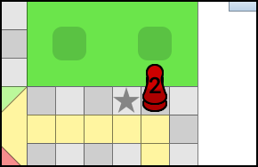
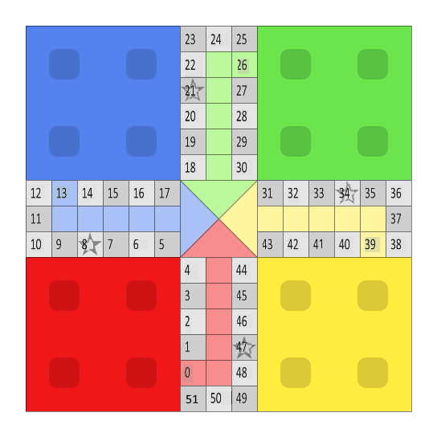

\pagebreak

As part of the LP2A UV, we had to make a Ludo game in Java, guided by the object-oriented programming principles. Ludo is a board game played with four players and a dice where each player has four pieces that start on a starting block. Players must move their pieces around the 56 squares on the board to reach their home square.The first of the 4 players to have all 4 pieces in the home square wins the game

# Conception choices

To make a functional game, we had to start by making choices that would define the entire organization of the code.

We decided to make three main classes for the game core: `Game`, `Player` and `Piece`, a `PlayerColor` enum to differentiate each player, four other classes for the graphical user interface: `MainMenu`, `GameWindow`, `PieceButton` and `BoardPosition` and a class for the artificial intelligence: `PlayerAIController`. Almost everything in the game is a Java Object instantiated from one of these classes.

\pagebreak

## The game progress and player turns

The `Game` object contains the `gameTurn` integer attribute that counts the elapsed number of turns since the beginning of the game. This counter increments every time the turn of a player ends. This value allows the game to determine the player who should play during a turn.

The turn count also allows to easily know if the first player has been determined as the decision is made at the end of the 4th turn. After this turn, the game behaves normally and the turn count increases until the end of the game.

### Player order shifting

The `Game` class contains the `playOrderShift` attribute that defaults to 0. This value shifts the `gameTurn` value when determining the current player for a turn. This value is decremented by 1 each time a player gets another roll so two consecutive turns can be played by the same player even if the game turn value was incremented.

### First player decision

At the beginning of the game, each player rolls the dice and the player who gets the highest number will start first. If two or more players gets the highest number, the game goes back to the first turn to start the decision phase again. If the first player has been determined, the 5th turn begins, the player order shift value is incremented so the player who got the highest roll starts to play.

{width=5cm}

### Playing procedure

When playing from the graphical user interface, the following methods are called in this order:

* The game waits for an action in the graphical user interface
* Clicking on the "Roll the dice" button: `GameWindow.rollDice()` → `Game.rollDice()`
* If a piece is selected: `GameWindow.play()` → `Game.rollDice()`
* If the "Pass your turn" button is clicked or a piece has been moved: `GameWindow.finishTurn()` → `Game.finishTurn()`

If the player is played by a computer, the dice roll and the piece move are automatically made without waiting for a listener in the game window.

## Blocked pieces

We have chosen not to create a different class which inherits from the `Piece` class for blocks because they still act as individual pieces in some events in the game. Instead, a piece contains a `blockPiece` attribute which contains the reference to the other piece of the block if the piece is blocked. If the piece is not blocked, this value is null. That's how the `isBlocked()` method knows if the piece is a block or not.

The `move()` method will also move the other piece to the same position and the graphical user interface shows a block as a stack of two pieces with the number 2 on it.

## The graphical user interface

The graphical user interface was claimed not to be the main goal of the project, but it still remains an important part of the project, as it uses a lot of interesting OOP tricks to work together with the game, and it allows us to see what is happening in the game object.

In our project, the `MainMenu` and `GameWindow` classes inherits from the Swing `JFrame` object. The first class handles the main menu display and instantiate the game and the game window as objects when starting a new game. The `GameWindow` class handle the whole graphical part of a game and allows the user to interact with the game.

When the game window object is created, the game reference is passed to it and the current game is always displayed. Every action made using the user interface is instantly reflected in the game.

### Properties files

Like what we had done in the lab course with `.properties` files, we created a `PropertiesReader` class that reads the content of the `string.properties` file in the resources of the project. The properties reader returns the localized string thanks to the `.getString(key)` method.
It allows us to localize strings easily. For the purpose of the project, only the English language was added.

### Display of pieces on the board

The board background is simply an image because drawing the board manually using Java's AWT API would be too inefficient and slow. Pieces are instances of the `PieceButton` class. When an event happens in the game, the board is refreshed using the `refreshBoard()` method and all the pieces are placed on the coordinates corresponding to the square they are on.

#### Pieces buttons

Every piece displayed on the board is a `PieceButton`, a class created for game pieces that inherits from `javax.swing.JButton`. This class overrides the constructor to set a custom style to the button to show a piece image instead of the default blue Swing button. The appearance of the button changes when the button becomes enabled or disabled. It allows the game to quickly see which pieces can be played The class also overrides the `setEnabled()` method to display a special cursor when a piece is selectable and the `setSize()` method so pieces images fits the square when several pieces are on the same square.

A `piece` attribute contains the reference to the piece corresponding to the button. Piece buttons and pieces are two completely different objects, the button is only meant to be used with the game JFrame and it does not inherits from a piece.

#### Coordinates computation

The `BoardPosition` class contains static methods to convert an absolute position of a piece in X and Y coordinates to display on the board. These methods return an instance of `BoardPosition` which contains an `x` and `y` attributes that can be fetched using the `getX()` and `getY()` methods.

For the main part of the track, the conversion is made using the `getXYPosition()` method and it computes the coordinates depending on the row and line of the board.

For pieces in their colored area, the used method is different because each colored area is on a different part of the board. `getEndXY()` returns a `BoardPosition` object depending on the color of the piece passed to the method.

The coordinates of a piece in the starting block is returned by the `getStartXY()` method that spreads the four pieces in the four squares of the starting block thanks to their index in the piece array of the player passed as an argument to the method.

#### Displaying several pieces on a square

There are safe squares in the game where two pieces can be on the same square without making a block or being captured. When more than a single piece is on a square, they are displayed as smaller pieces. The pieces on the square are returned by the `piecesOnSquare()` method in the game object as a `java.util.ArrayList`. The maximum capacity per row is computed using the ceiling of the square root of the number of pieces of square (the number of elements in the ArrayList. Then each piece is placed on the first row until the row is full where the piece goes in the lower row. If only a blocked piece is on a square, it's displayed as a single blocked piece, and if there are other pieces or blocks on the same square, one of the pieces in every block is hidden to avoid displaying a block as two separate pieces because they already have the appearance of a block.

### Action listeners

Three action listeners were added to the `Game` class as `ActionListener` instances, one for the "Roll the dice" button, one for the "Continue/Pass your turn" button, and another for pieces. These listeners are declared as an attribute in the `GameWindow` class so they can use other methods and attributes from the current instance of `GameWindow`.

The listener for pieces buttons gets the corresponding piece by calling `getPiece()` on the clicked `PieceButton` from the listener `ActionEvent`.

## Position of pieces

Each piece has a `position` attribute which defines the square where the piece is. This number is an integer from -1 to 56 and a positive value means that the piece is on the track of the board. The -1 value is used to indicate that the piece is on the starting block.

Each player has its own relative position numbers where 0 is the very first square and 56 is the home square. 

On the main looping part of the track, each square has also an identifier from 0 to 51. To get this value from a relative position, the `getRelativePosition()` method from the `Player` class returns the sum of the relative position and the initial starting square. We make the modulo 52 of this number to get a number between 0 and 51 in the clockwise direction.

{width=8cm}

This absolute position will be used to check if two pieces are on the same square.

## The artificial intelligence

A basic artificial intelligence was added to the game and can play according to this set of rules:

1. Move a piece out of the starting block if another piece of the same color is further than halfway across the board.
2. If the player has a piece ahead from other pieces, move this piece.
3. Fallback rule: If no piece has been determined because the AI could not find a suitable piece to play, the computer selects its first playable piece.

Here are some other ideas that were not added into the AI:

* Try to make a block if two pieces are near the end
* Try to capture a piece before applying other rules
* Stay behind another piece to avoid being captured if other pieces are too far behind

# Unfixed issues

### The 51st square

Currently, the `isInColoredArea` method in the `Piece` class returns true if the player **can enter the colored area** but it should return true if the piece **is in the colored area**. Because of the limitations of the chosen implementation, it's not easily possible to get the real position of a piece that is on a square shared between a colored area and the main track. The only square that is concerned by this problem is the square 51, it follows the square 50 before the colored area and the other squares between 52 and 56 are not concerned because after 51, the main track returns to 0. This is not a huge problem because the condition should be the same as "is in the colored area" in most cases. The odds of this happening are extremely low and fixing it requires having a completely different position system for the colored area. A new class `Position` could have been used for the piece position instead of an int for example.

### Player selection when playing with computers

When starting a new game from the main menu, a new instance of `Game` is created and the number of computer players is passed to the constructor. The game constructor creates the selected number of computers passed by the main menu, and the remaining human players are added to reach four players, so in the mode with a player and three computers, the human player will be the last player in the list (Yellow). A player selection dropdown could have been added in the user interface but we focused on the game rather than the main menu.

# Conclusion

We managed to implement all the official rules of Ludo in our project:

- The first player is the one who got the highest roll at the beginning
- If two or more players gets the highest number, each player rolls the dice one more time
- The current player gets another roll if it rolls a 6 during the game, except for the first 6
- The player must pass its turn if he rolls a 6 three times in a row 
- A piece can only go out of the starting block if the player rolled a 6
- If a piece lands on a piece
  - If the square is a safe zone, nothing happens and both pieces are on the same square without interacting with each other
  - If it's not a safe zone
    - If the other piece has the same color, they form a block
    - If the other piece has a different color, it goes back to the starting square
- A blocked piece prevent other pieces from passing over it or landing on it
- A blocked piece can capture another block
- A piece starts another lap on the board if the player has not captured a piece yet

The final game is fully playable and all the official rules of the game are functional although some details could not be implemented due to the mix of time constraints and initial conception choices. The optional game mode was also made with a very limited set of rules but works quite well.

